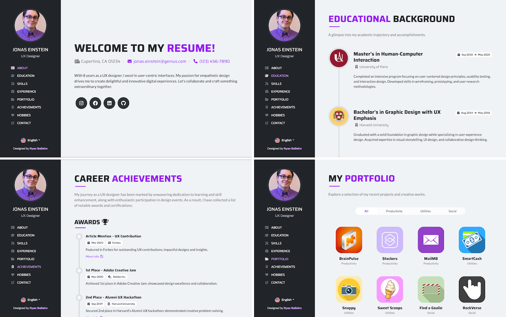

# Preview

Screenshots [Replace with our own Screenshot]



# Backend
## ResilientDB and ResilientDB GraphQL
ResilientDB local Server and HTTP server

## Get Prepared 

(If you're using this for the first time, the steps below would be useful)

Install **Ubuntu 20.04** on your local machine.

Install miniconda using the command.

    mkdir -p ~/miniconda3
    wget https://repo.anaconda.com/miniconda/Miniconda3-latest-Linux-x86_64.sh -O ~/miniconda3/miniconda.sh
    bash ~/miniconda3/miniconda.sh -b -u -p ~/miniconda3
    rm -rf ~/miniconda3/miniconda.sh
    ~/miniconda3/bin/conda init bash

## Using the ResilientDB server

To use the ResilientDB server, you need to build ResilientDB and deploy 4 replicas and 1 client proxy on your local machine. The proxy acts as an interface for all the clients. It batches client requests and forwards these batches to the replica designated as the leader. The 4 replicas participate in the PBFT consensus to order and execute these batches. Post execution, they return the response to the leader.

    git clone https://github.com/resilientdb/resilientdb.git

Install dependencies:

    ./resilientdb/INSTALL.sh

## Using the HTTP server

To use the HTTP server, you need to start a KV service first, which you can refer to the [resilientdb](https://github.com/resilientdb/resilientdb) repository and the [blog](https://blog.resilientdb.com/2022/09/28/GettingStartedNexRes.html). 

    git clone https://github.com/ResilientApp/ResilientDB-GraphQL.git

You have to change the folder name for this repository because "-" is a problem for python to import package

    mv ResilientDB-GraphQL ResilientDB_GraphQL

Then you should start the crow http service, which may take a few minutes at the first time.
    
    bazel build ResilientDB_GraphQL/service/http_server:crow_service_main

## Start the Backend server and the HTTP server

In the below command, the shell script starts the http server as well as the backend server. It awaits the signal (Ctrl+C) to kill both server.

    ./run.sh


# Frontend

The Res-a-Me Frontend is a web application that serves as the user interface for the Res-a-Me project. It is built using modern web technologies such as HTML, CSS, and JavaScript, and follows a responsive design approach to ensure compatibility across different devices and screen sizes. The frontend interacts with the backend API to retrieve and display user data, allowing users to create, update, and manage their resumes seamlessly. The application provides a user-friendly interface with intuitive navigation and interactive features, making it easy for users to create professional resumes and showcase their skills and experiences effectively.

Key features:
- Authentication for users personalizatio.
- An anchored fixed side navigation bar for smooth scrolling through the page.
- Four custom section layouts showcasing work experience, educational background, professional skills.
- Allow users to edit their own professional achivements.
- Allow users to crop their upload headshot image. 
- Enable users to search for other people profile.
- Using Vite for faster build times and seamless integration.


1. Navigate to the frontend directory of the project and install all dependencies with npm:
```
cd frontend
npm install
```

2. Run the project in developer mode:
```
npm run dev
```

3. If you already run the backend server, open browser and you will see Res-a-Me running on localhost:5173

### Reference
[Vue Resume Template](https://ryanbalieiro.github.io/vue-resume-template/) by Ryan Balieiro
