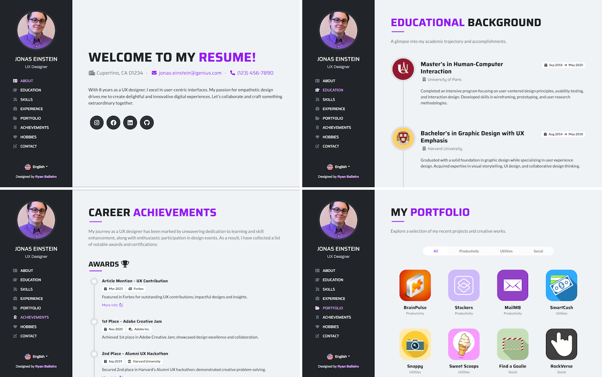

# Res-a-Me Frontend

The Res-a-Me Frontend is a web application that serves as the user interface for the Res-a-Me project. It is built using modern web technologies such as HTML, CSS, and JavaScript, and follows a responsive design approach to ensure compatibility across different devices and screen sizes. The frontend interacts with the backend API to retrieve and display user data, allowing users to create, update, and manage their resumes seamlessly. The application provides a user-friendly interface with intuitive navigation and interactive features, making it easy for users to create professional resumes and showcase their skills and experiences effectively.

Key features:
- Authentication for users personalizatio.
- An anchored fixed side navigation bar for smooth scrolling through the page.
- Four custom section layouts showcasing work experience, educational background, professional skills.
- Allow users to edit their own professional achivements.
- Allow users to crop their upload headshot image. 
- Enable users to search for other people profile.
- Using Vite for faster build times and seamless integration.

## Preview

### 1. Screenshots [Replace with our own Screenshot]



## Getting Started

1. Clone the repo:
```
git clone [repo-url]
```

2. Navigate to the frontend directory of the project and install all dependencies with npm:
```
cd frontend
npm install
```

3. Run the project in developer mode:
```
npm run dev
```

4. If you already run the backend server, open browser and you will see Res-a-Me running on localhost:5173

### Reference
[Vue Resume Template](https://ryanbalieiro.github.io/vue-resume-template/) by Ryan Balieiro